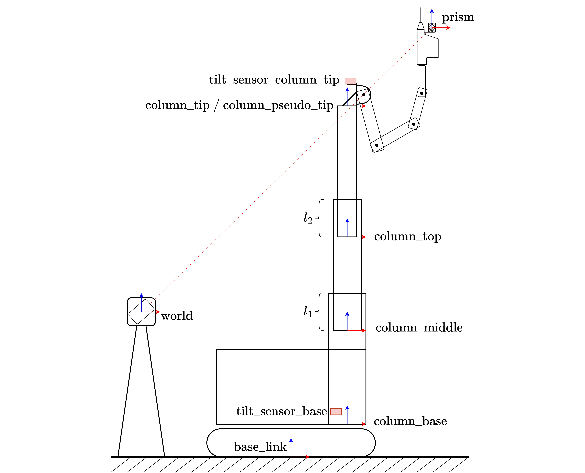
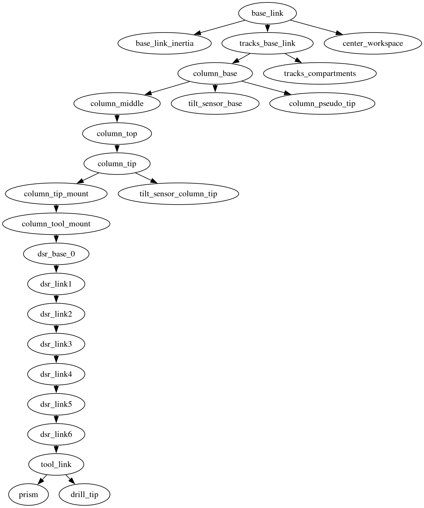

# Construction Robot Stationing Datasets

This repository contains the stationing datasets used in the publication "Enhancing Robotic Precision in Construction: A Modular Factor Graph-based Framework for Deflection and Backlash Compensation Using High-Accuracy Accelerometers" recorded on Trailblazer, a prototype of the [Hilti JaiBot](https://www.hilti.group/content/hilti/CP/XX/en/company/media-relations/media-releases/Jaibot.html).

## Datasets

The datasets can be used to evaluate stationing routines of mobile manipulators. In each dataset, the robot arm and lifting column were positioned at about 450 waypoints. At each waypoint, the system stopped and waited for all oscillations to cease. Then, the sensor measurements were recorded, including:

- Position of the prism relative to the total station
- Joint states of the robot (lifting column and manipulator)
- Accelerometer measurements from two ADXL355 sensors mounted to the base and the tip of the lifting column

We refer to the set of measurements at a common height and solution space of the manipulator as a station. Each station contains:

- **Stationing points**: These should be used to determine the position of the robot relative to the total station. All three types of measurements should be utilized.
- **Evaluation points**: These should be used to assess the accuracy of the stationing results. The algorithm should predict the position of the prism relative to the total station using the stationing points and compare the prediction against the actual total station measurement.

In our publication, we performed separate stationing for each column height and each solution space of the manipulator. Additionally, out of the 8 stationing points provided at each station, we used only the four points forming a square.

The following table summarizes the individual datasets provided. Unless otherwise stated, all datasets were recorded at 21°C room temperature.

| Filename             | Description                                                                                                 |
|----------------------|-------------------------------------------------------------------------------------------------------------|
| flat.yaml            | Dataset used for calibration. Operation on level surface at room temperature with no external disturbances. |
| pallet.yaml          | Robot positioned on a wooden pallet.                                                                        |
| orthogonal_wood.yaml | Wooden slab orthogonal to the robot’s axis under the front of tracks, causing a backward tilt.              |
| wood_left_track.yaml | Wooden slab under the front of the left track, causing a tilt backward and to the right.                    |
| seesaw.yaml          | Front of tracks on an aluminum seesaw, causing a strong tilt backward.                                      |
| diagonal_wood.yaml   | Wooden slab under tracks, oriented diagonally, tilting the robot backward and to the left.                  |
| outdoor.yaml         | Captured outdoors at 9°C, contrasting with the 21°C of other datasets. Flat floor.                          |

## Examples

We provide two examples of how to use the datasets. The file `requirements.txt` contains the python dependencies for `example_kabsch.py`. For running `example_handeye.py`, you additionally need GTSAM with the python bindings installed. 

### example_kabsch.py

In this example, we find the transform `T_world_base` by least-squares fitting the stationing measurements of the total station `t_world_prism` against the forward kinematics estimates `t_base_prism` using the Kabsch Algorithm. Then, we use this station to estimate the prism position for all evaluation points `t_world_prism_est = R_world_base t_base_prism + t_world_base` and compare it against the actual total station measurements.

### example_handeye.py

In this example, we perform a hand-eye calibration using the Python wrapper of GTSAM on the flat dataset to determine the position of the prism relative to the end effector of the manipulator `t_ee_prism`. Then, similarly to before, we perform a least-squares fit of `T_world_base` using the stationing points, this time using GTSAM. As before, we estimate the prism position for all evaluation points and compare it against the actual total station measurements.

## Robot Overview

### Hardware Specifications

* Robot: Hilti JaiBot Prototype
* Accelerometers: Analog Devices ADXL355. The scalings of the accelerometers were calibrated on a goniometer
* Total Station: Hilti PLT 300

### URDF file
The file `data/trailblazer.urdf` captures the kinematic chain (from CAD) as well as the masses and inertias of the system. The TF tree looks as follows:

In the URDF and the datasets, we capture the joint state of the joint `column_prismatic_joint` which is the transform `column_base -> column_pseudo_tip`. The actual joints `column_middle_joint` (`column_base -> column_middle`) and `column_top_joint` (`column_middle -> column_top`) are set up as mimic joints. This is chosen this way such that we are able to describe both joints with a nicely interpretable virtual joint while still being able to use the URDF for deflection modeling with the actual joints in the kinematic chain.

### Accelerometer Placement
The accelerometers, denoted as `tilt_sensor_<LOCATION>` in the URDF, are strategically placed on the rigid base and at the tip of the lifting column.

### Column Mechanics
The lifting column consists of two segments, both actuated by a single motor, ensuring that both segments extend simultaneously by the same amount. The resulting overlaps of the segments are calculated as follows:

        l1 = 1.448 - joint_state__column_middle_joint
        l2 = 1.414 - joint_state__column_top_joint

Here, `joint_state__column_middle_joint` and `joint_state__column_top_joint` represent the states of the respective joints. In the URDF, these joints are mimic joints, mimicking the `column_prismatic_joint` as observed in the datasets.

Including the mimic joint in the formulas, the resulting overlaps are:

        l1 = 1.448 - (0.5 * joint_state__column_prismatic_joint - 0.706)
        l2 = 1.414 - (0.5 * joint_state__column_prismatic_joint - 0.736)

### Measurement Standard Deviations
We used the following standard deviations for our measurements (all derived from the respective datasheets)

| Sensor                             | Standard Deviation                         | Unit    |
|------------------------------------|--------------------------------------------|---------|
| Total Station Position Measurement | [0.75e-3, 0.75e-3, 0.75e-3]                | [m]     |
| Total Station Gravity Alignment    | [4.848e-5, 4.848e-5]             | [rad]   |
| Accelerometers                     | [4.3610059e-4, 4.3610059e-4, 4.3610059e-4] | [m/s^2] |